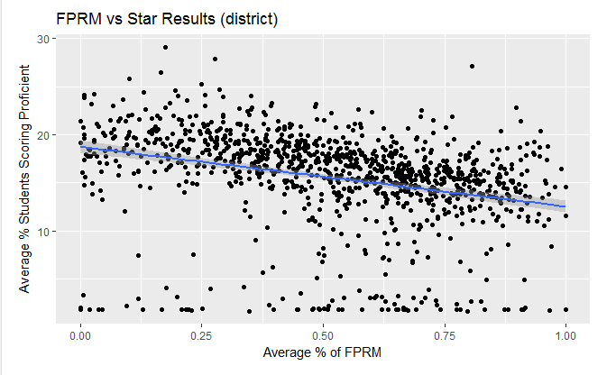
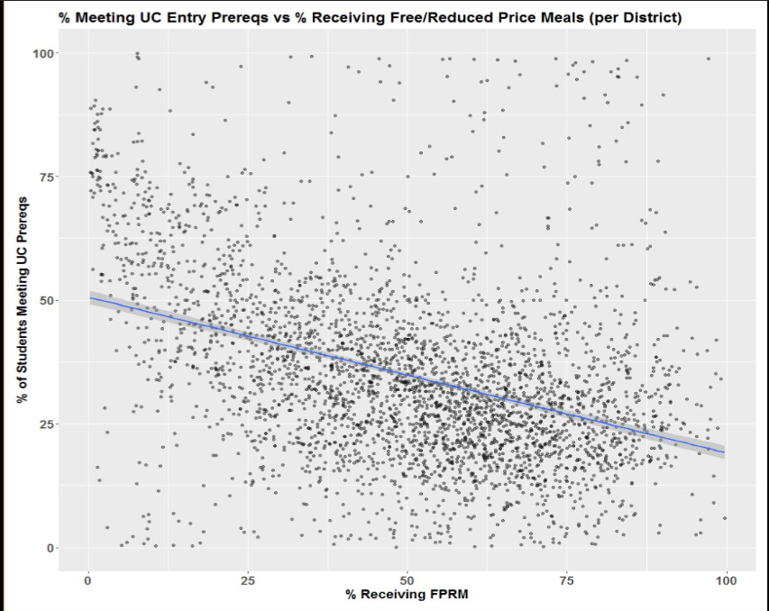
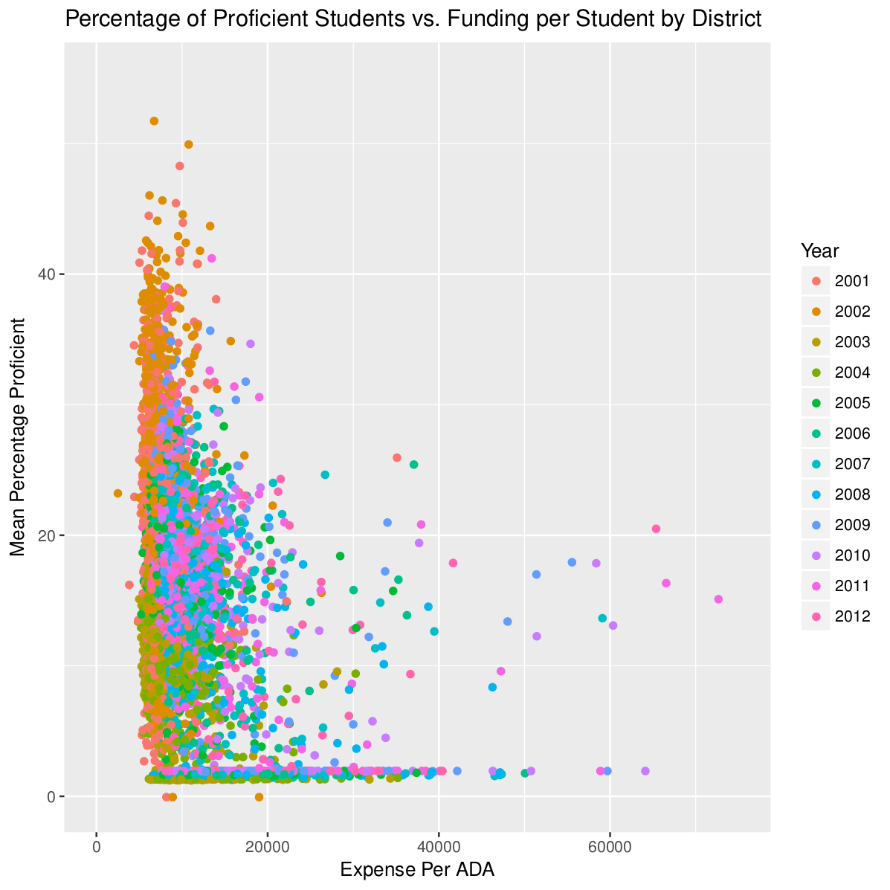
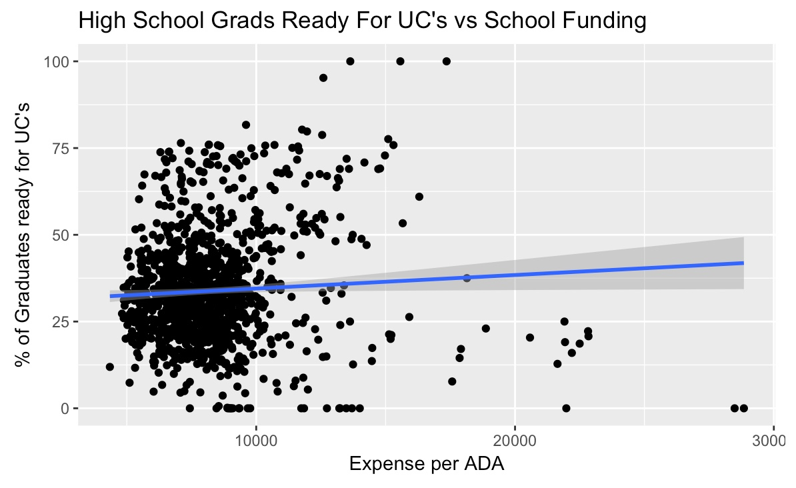

```{r setup, include=FALSE}
knitr::opts_chunk$set(echo = FALSE)
```

## All Net: Academic Performance and Contributing Factors

<strong>Key Questions</strong>

1. What is the correlation between academic performance and factors such as funding and economic background? 
2. Does change in grouping have an effect on the trend line?

<strong>Data Source</strong>

California Department of Education

<strong>Methods</strong>

In class: Regex, Data Structures, Loops, Data Wrangling
Outside class: Feather

<strong>Important variables</strong>

District Code, District Type, PercentProficient, Year (1998 to 2012), UC Elgible, avg_PR_FRPM, avg_EXPENSE_per_ADA

----





----




